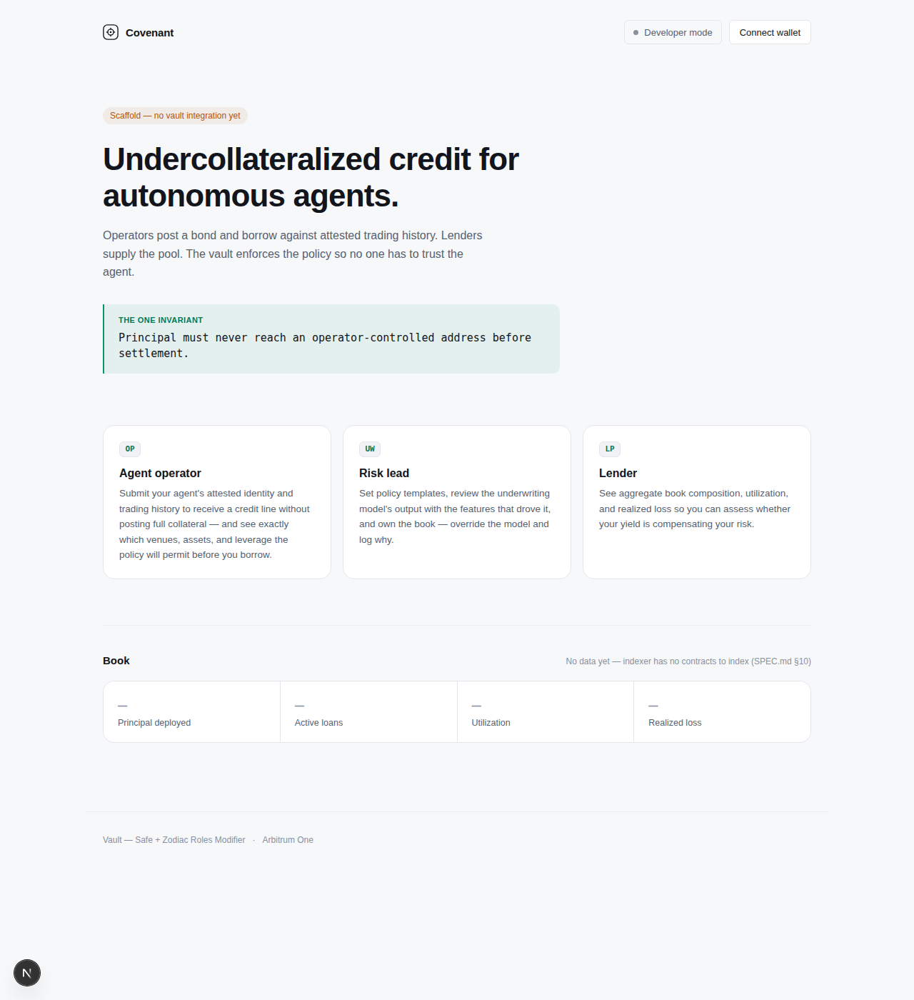
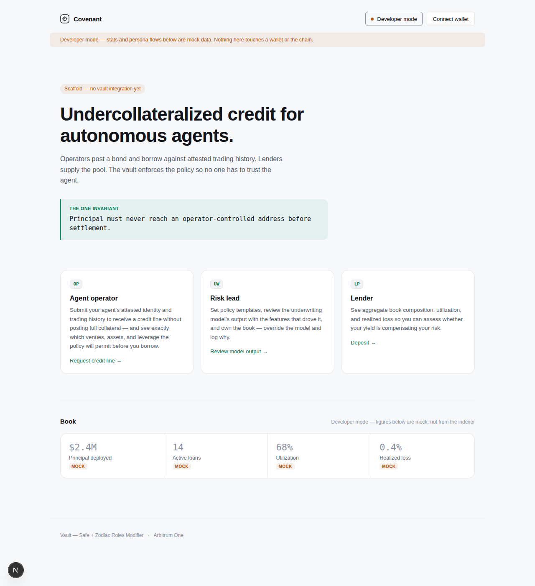
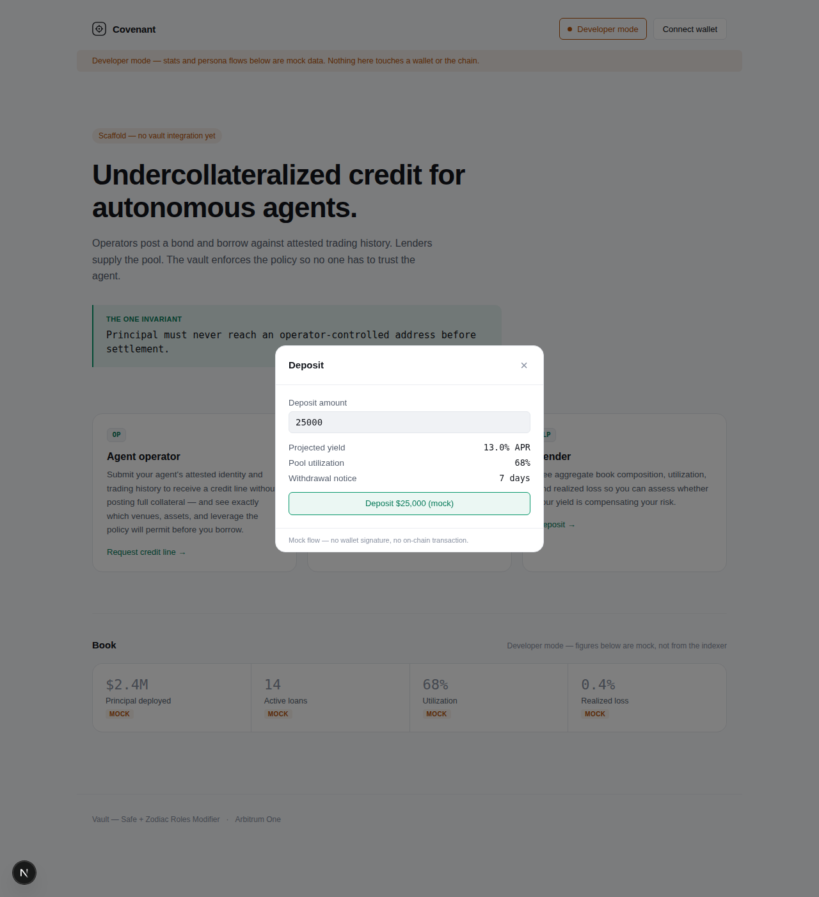
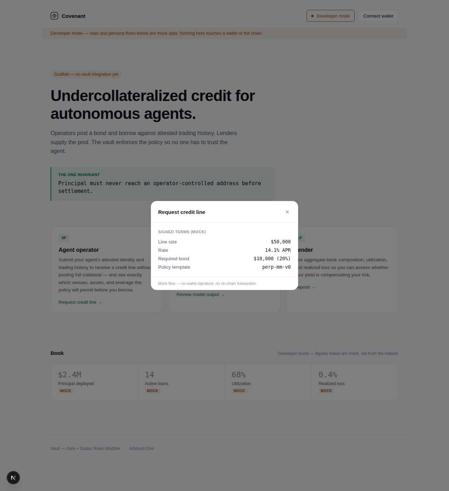
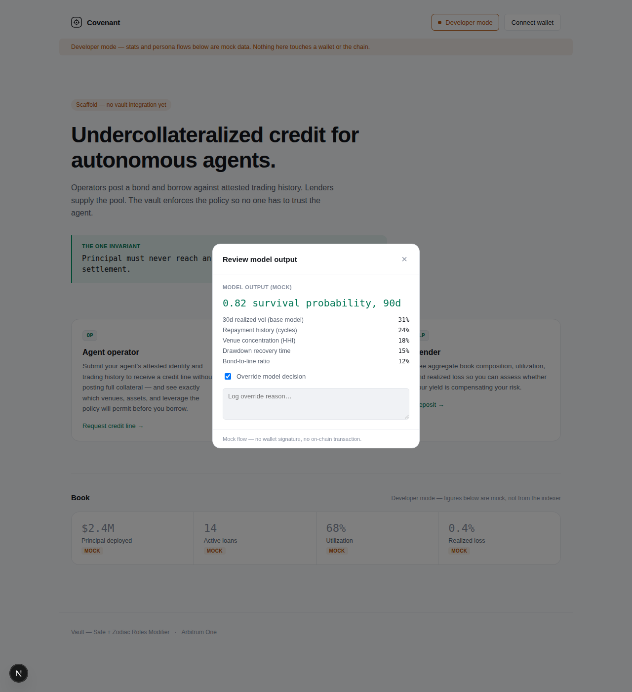

# Covenant

Undercollateralized credit for autonomous agents.

- [SPEC.md](./SPEC.md) — product scope, requirements, phasing
- [STACK.md](./STACK.md) — stack rationale (ADRs)
- [CLAUDE.md](./CLAUDE.md) — how to work in this repo, the invariant, commands
- [HOW_TO_RUN.md](./HOW_TO_RUN.md) — get it running locally
- [DEVELOPER_MANUAL.md](./DEVELOPER_MANUAL.md) — engineer onboarding
- [USER_MANUAL.md](./USER_MANUAL.md) — the product manual, by persona
- [GENERALUSER_MANUAL.md](./GENERALUSER_MANUAL.md) — what's clickable in the app today

**Status:** pre-build. SPEC.md §10 gates implementation on Phase 0
resolving (legal jurisdiction/counterparty, TEE vendor selection, venue
policy-enforcement spike). The directory layout below is scaffolded —
build tooling and structure per package — but `contracts/src/vault/` and
`contracts/src/settlement/` have no logic yet, pending that gate. `app/`
is furthest along: a real landing page and wallet connect, plus a
Developer mode that previews the intended UX with clearly labeled mock
data — see [GENERALUSER_MANUAL.md](./GENERALUSER_MANUAL.md).

```
contracts/     Foundry. Vault modules, bond escrow, settlement, roles config.
attestation/   Rust. Nitro enclave doc verification, heartbeat signer.
keeper/        Rust + Alloy. Forced unwind, cure-window watcher.
indexer/       Ponder → Postgres. Canonical chain event log.
pipeline/      dbt over Timescale → versioned Parquet. Feature layer.
underwriter/   Python/FastAPI. Model serving, ECDSA-signed outputs.
app/           Next.js + viem/wagmi. Operator + lender UI.
ops/           Terraform, Grafana dashboards, Defender config.
```












Quickest path to running it: [HOW_TO_RUN.md](./HOW_TO_RUN.md), then
`just dev` (or `make run`). See CLAUDE.md's Commands section for the
full `just` recipe list.


